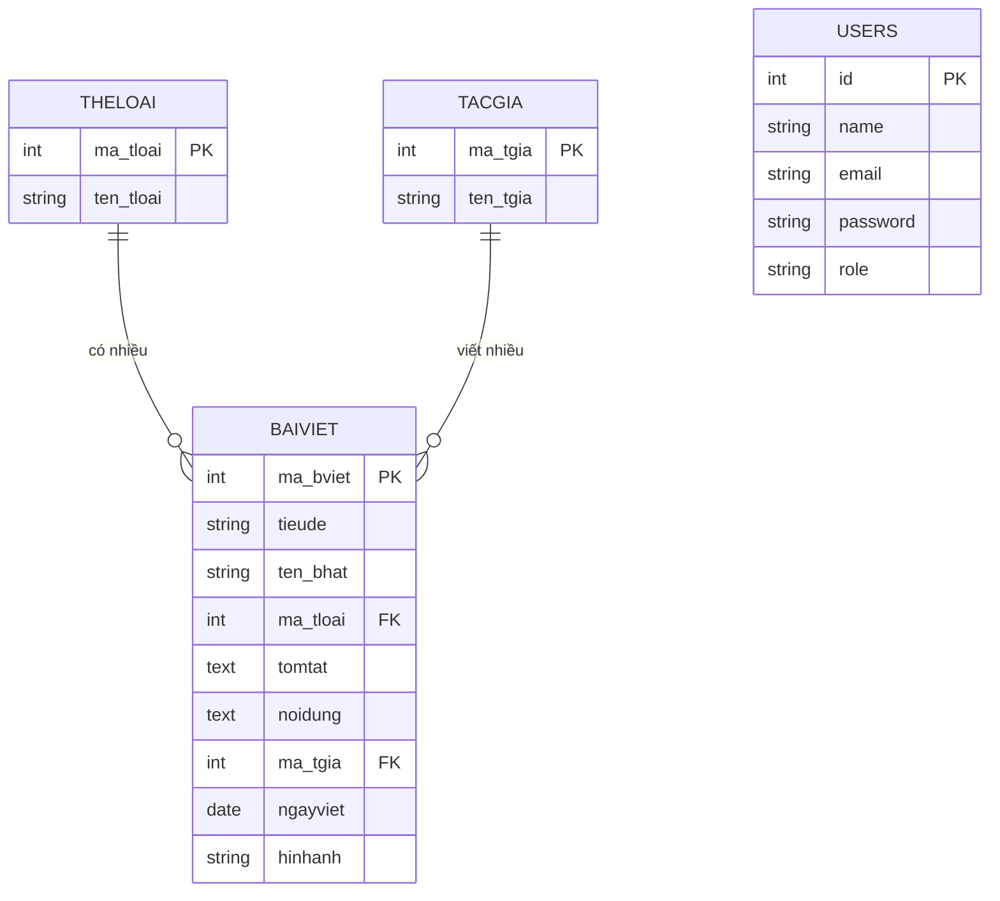

# 🎵 Hệ Thống Quản Lý Bài Viết Âm Nhạc

> **Đồ án môn CSE485 – Công nghệ Web**
> Trường Đại học Cần Thơ

Ứng dụng web quản lý bài viết cảm nhận âm nhạc, xây dựng trên nền tảng **Laravel Framework**. Hệ thống cho phép quản trị viên thực hiện CRUD bài viết, tác giả, thể loại và người dùng có thể xem nội dung trên giao diện công khai.

---

## 👥 Thành viên nhóm

| STT | Họ và tên             | Vai trò       |
|-----|-----------------------|---------------|
| 1   | Bùi Đức Tùng          | Thành viên    |
| 2   | Đào Duy Minh          | Thành viên    |
| 3   | Nguyễn Ngọc Bảo Tuấn  | Thành viên    |

---

## 🚀 Công nghệ sử dụng

| Thành phần      | Công nghệ                  |
|-----------------|-----------------------------|
| Framework       | Laravel 13.x                |
| Ngôn ngữ        | PHP 8.3+                    |
| Cơ sở dữ liệu  | MySQL                       |
| Frontend        | Bootstrap 5.3, Font Awesome |
| Template Engine | Blade                       |
| ORM             | Eloquent                    |

---

## ✨ Tính năng chính

### 🌐 Trang công khai
- Trang chủ hiển thị danh sách bài viết với carousel slideshow
- Xem chi tiết bài viết cảm nhận âm nhạc
- Giao diện responsive, thân thiện với thiết bị di động

### 🔐 Xác thực & Phân quyền
- Đăng nhập / Đăng xuất
- Phân quyền Admin / User thông qua middleware
- Bảo vệ các route quản trị

### 🛠️ Trang quản trị (Admin Panel)
- **Dashboard**: Tổng quan hệ thống
- **Quản lý Thể loại**: Thêm, sửa, xóa thể loại âm nhạc (Nhạc Việt, Rock, Pop, ...)
- **Quản lý Tác giả**: Thêm, sửa, xóa thông tin tác giả/nhạc sĩ
- **Quản lý Bài viết**: Thêm, sửa, xóa bài viết cảm nhận (liên kết tác giả & thể loại)

---

## 📁 Cấu trúc dự án

```
CSE485_2023/
├── app/
│   ├── Http/
│   │   ├── Controllers/
│   │   │   ├── Admin/                  # Controllers quản trị
│   │   │   │   ├── ArticleController   # CRUD bài viết
│   │   │   │   ├── AuthorController    # CRUD tác giả
│   │   │   │   ├── CategoryController  # CRUD thể loại
│   │   │   │   └── DashboardController # Trang tổng quan
│   │   │   ├── AuthController          # Đăng nhập / Đăng xuất
│   │   │   ├── ArticleController       # Xem chi tiết bài viết
│   │   │   └── HomeController          # Trang chủ
│   │   └── Middleware/
│   │       └── AdminMiddleware         # Kiểm tra quyền admin
│   └── Models/
│       ├── BaiViet.php                 # Model bài viết
│       ├── TacGia.php                  # Model tác giả
│       ├── TheLoai.php                 # Model thể loại
│       └── User.php                    # Model người dùng
├── database/
│   ├── migrations/                     # Tạo cấu trúc bảng
│   └── seeders/                        # Dữ liệu mẫu
├── resources/views/
│   ├── layouts/                        # Layout chung (app, admin)
│   ├── admin/                          # Giao diện quản trị
│   ├── auth/                           # Trang đăng nhập
│   ├── home.blade.php                  # Trang chủ
│   └── detail.blade.php               # Chi tiết bài viết
├── routes/
│   └── web.php                         # Định nghĩa routes
├── public/                             # Assets (images, CSS)
└── _old_backup/                        # Code PHP thuần (bản cũ)
```

---

## 🗄️ Cơ sở dữ liệu

### Sơ đồ quan hệ



---

## ⚙️ Hướng dẫn cài đặt

### Yêu cầu hệ thống
- PHP >= 8.3
- Composer
- MySQL
- Node.js & npm (tùy chọn, cho Vite)

### Các bước cài đặt

```bash
# 1. Clone dự án
git clone https://github.com/westncd/CSE485_2023.git
cd CSE485_2023

# 2. Cài đặt dependencies
composer install

# 3. Tạo file cấu hình
cp .env.example .env

# 4. Tạo application key
php artisan key:generate

# 5. Cấu hình database trong file .env
#    DB_CONNECTION=mysql
#    DB_HOST=127.0.0.1
#    DB_PORT=3306
#    DB_DATABASE=btth01_cse485
#    DB_USERNAME=root
#    DB_PASSWORD=

# 6. Tạo database và chạy migration
php artisan migrate

# 7. Chạy seeder để tạo dữ liệu mẫu
php artisan db:seed

# 8. Khởi chạy server
php artisan serve
```

Truy cập ứng dụng tại: `http://localhost:8000`

---

## 🔑 Tài khoản mặc định

| Tài khoản | Email            | Mật khẩu   | Quyền   |
|-----------|------------------|-------------|---------|
| admin     | admin@local.com  | `admin123`  | Admin   |
| user      | user@local.com   | `user123`   | User    |

> **Trang quản trị:** `http://localhost:8000/admin`

---

## 🛣️ Danh sách Routes

| Method   | URI                       | Mô tả                    |
|----------|---------------------------|---------------------------|
| GET      | `/`                       | Trang chủ                 |
| GET      | `/detail/{song}`          | Chi tiết bài viết         |
| GET      | `/login`                  | Trang đăng nhập           |
| POST     | `/login`                  | Xử lý đăng nhập          |
| POST     | `/logout`                 | Đăng xuất                 |
| GET      | `/admin`                  | Dashboard quản trị        |
| Resource | `/admin/categories`       | CRUD thể loại             |
| Resource | `/admin/authors`          | CRUD tác giả              |
| Resource | `/admin/articles`         | CRUD bài viết             |

---

## 📝 Ghi chú

- Thư mục `_old_backup/` chứa code PHP thuần (phiên bản cũ trước khi migrate sang Laravel)
- File `.env` không được push lên GitHub (đã có trong `.gitignore`)
- Sử dụng `.env.example` làm mẫu để tạo file `.env` cục bộ

---

## 📄 License

Dự án phục vụ mục đích học tập môn **CSE485 – Công nghệ Web**, Trường Đại học Cần Thơ.
